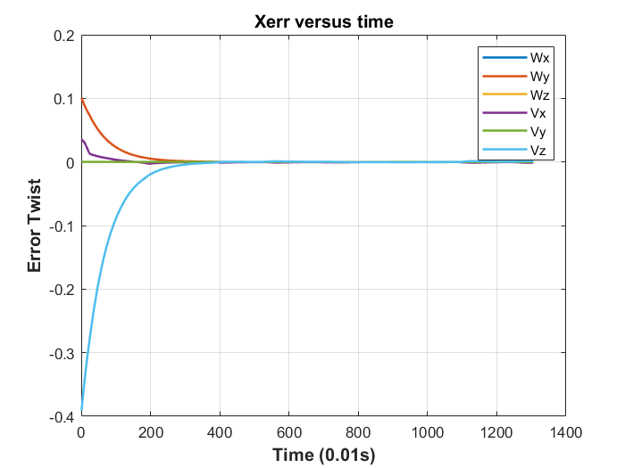

# Capstone Project

* This repository records my implementation for the [Capstone Project](https://www.youtube.com/watch?v=Q1CekpBW6Js&feature=youtu.be) related with the book ***"Modern Robotics"*** along with its [packaged course videos](https://modernrobotics.northwestern.edu/nu-gm-book-resource/introduction-autoplay/#department) .
* The project requires us to write a software to plan a trajectory for the end-effector of  ***youBot*** (*a 5R robot arm articulated on a four mecanum wheels mobile base*) to move a cube from one to another specific location and implement a  control system forcing the whole body to follow that trajectory. 
* In this project, you could design the relative configuration of the end-effector and the cube when grasping, planning the end-effectors' trajectory as you like, and adjust the controller parameter to get better performance. The project uses velocity control so no robot dynamics is involved.  
* Details of the project (basic operations on VREP, Initial configurations, size of the mobile base, screw axis......) could be found on the [project web page](http://hades.mech.northwestern.edu/index.php/Mobile_Manipulation_Capstone)


## Results

|  |
| :----------------------------------------------------------: |
| [](https://www.mathworks.com/products/matlab.html) |

To get a balance between faster error twist convergence speed and less oscillation and smaller steady state error, adjusting the `Kp`,`Ki` of the feedback controller and obtain a relatively good performance of the robot(Error twist versus time shown below).  Besides, you could find the simulation **video** in `\results`


 

## Instructions

1. The folder `\mr` includes the  ***Modern Robotics*** code library of the corresponding book, you could always download that [here](https://github.com/NxRLab/ModernRobotics). Remember to download and include that in your Matlab searching path.

   ``` matlab
   % Below is an example for including the source code 
   root = fileparts(pwd);
   project_name = "Final Project";
   sourceCode_name = "mr";
   addpath(genpath(fullfile(root,project_name,sourceCode_name)));
   ```

   

2. Run `runscript.m`  to generate:

   * A file contains the calculated trajectory for the end-effector : `Traj.csv`

   * A file used to simulate the robot motion in *CoppeliaSim* : `Animation.csv`

   * A plot showing the change of error twist versus time and the data file : `Xerr.mat`

     program running log file shown as follows:

     ~~~ matlab
     >> runscript
     Initialization completed
     Initialization completed
     Youbot object created!
     Trajectory generated
     Feedback Control applied, Animation file generated
     Successfully plot Xerror vesus time
     ~~~

3. The code is Object-Oriented, by constructing the *youBot* object `Mybot` which is the subclass of the four mecanum wheels mobile base class  *mobileRobot*. With the Inherited feature of *OOP* and some essential properties and useful methods included in the class file, the code seems very fluent and well wrapped.

   ``` matlab
   % Manual choose the initial parameter of the controller and the robot
   % configuration
   Mybot.q = [0,0,0];
   Mybot.theta = [0,0,0.2,-1.67,0]';
   Mybot.wheelAngle = [pi/2,pi/2,pi/2,pi/2];% Do not affect the simulation
   Mybot.kp = 1.5 * eye(6);
   Mybot.ki = 0 * eye(6);
   maxspeed = 12.3*ones(1,9);% take uniform max speed.
   jointLimits = [[pi,-pi]',[pi,-pi]',...
       [pi,-pi]',[pi,-pi]'...
       ,[pi,-pi]'];% Designed values to avoid collision : [max;min]
   
   [Td,grasp] = traj2mat(Traj);% Td is a 3D matrix
   
   % Apply Fb control to the Youbot object.
   % All other parameter needed is included in the obj's property.
   [Animation,Xerr] = Mybot.FeedbackControl(dt,Td,maxspeed,grasp,jointLimits);
   
   ```

4. Every single file of this code is well commented, if you still have problem understanding some part of that, feel free to contact me via yul131@eng.ucsd.edu.

## Acknowledgements

The code is written for the final project for the grad course MAE 204 ***"Robotics"***  in University of California San Diego, instructed by Professor Mike Tolley. Use this code only for study and help understand the exponential coordinate representation of robot motion if you are interested.


